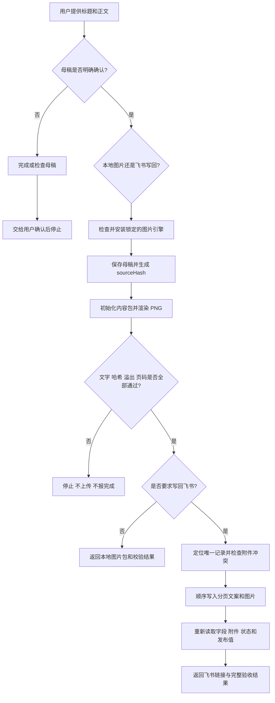

# 寂辉求职内容发布流水线

这是一个连接“确认母稿、图片生成、飞书写回”的 Codex Skill。它把已经定稿的求职内容锁定为唯一来源，调用独立图片引擎生成并校验小红书图片包，再按用户要求选择是否写回飞书。生成图片、写回飞书和公开发布是三个不同动作。

## 这个 Skill 解决什么问题

内容生产最容易在交接环节出错：确认的是 A 稿，出图时用了 B 稿；图片有 6 页，飞书只写了 4 页；附件上传成功了，但正文和状态没有读回验证；最后还把“写回素材库”误当成“已经公开发布”。

这个 Skill 把这些环节串成一条可追溯流水线：

- 确认母稿是唯一正文来源，使用 SHA-256 `sourceHash` 防止中途换稿。
- 分页、渲染和图片校验统一交给固定版本的图片 Skill。
- 仅本地出图时不要求用户提供任何飞书信息。
- 飞书写回后必须重新读取正文、页数、附件、状态和发布字段。
- 公开发布始终是新的外部动作，不会因为用户同意出图就自动执行。

它适合已经完成内容定稿后的生产阶段。母稿还在讨论、只想改文案或只想直接公开发布时，不应跳过相应确认步骤调用这条流水线。

## 整体运行流程



一句话理解：`输入 → 处理 → 输出`，也就是“已确认母稿和目标模式 → 锁稿、出图、校验、可选写回与读回 → 可验证图片包或飞书记录”。

## 开始前准备

本地图片模式需要：

1. 已经明确确认的标题和正文，或一个最终 Markdown 文件。
2. Node.js 20+。
3. 一个可写的输出目录；没有指定时，Skill 会在当前目录创建时间戳文件夹。

飞书写回模式还需要：

1. 已配置且能执行 `lark-cli whoami` 的飞书环境。
2. 目标 Base、数据表和记录信息，或者能唯一定位记录的业务键。
3. 对本次飞书写入和附件上传的明确要求。

只做本地图片不需要飞书地址、飞书凭据或表格字段映射。

## 安装

安装本 Skill：

```bash
npx skills add Amentman/job-content-publisher@job-content-publisher -g -y
```

只安装到当前项目：

```bash
npx skills add Amentman/job-content-publisher@job-content-publisher --agent codex --yes --copy
```

第一次出图时会自动安装并检查锁定的 `xiaohongshu-image-renderer v0.2.1` 及其 Playwright/Chromium 环境。也可以在本 Skill 目录手动准备：

```bash
node scripts/bootstrap-renderer.mjs --install
```

## 第一次使用

只生成本地图片：

```text
使用 $job-content-publisher 把这份确认母稿生成小红书图片包。本次只生成本地文件，不写飞书、不公开发布。标题是……，正文文件是 /path/to/master.md。
```

生成并写回飞书：

```text
使用 $job-content-publisher 处理这条已经确认的母稿，生成图片并写回我提供的飞书记录。完成后读回核对正文、页数、附件和发布状态；不要打开平台发布页。
```

母稿没有明确确认时，Skill 只完成母稿或风险检查，交给用户确认后停止，不会提前出图。

## 每一步会发生什么

| 步骤 | 用户提供或决定 | Skill 会做什么 | 可验证产物 |
|---|---|---|---|
| 1. 确认母稿 | 明确“可以、定稿、就按这个” | 锁定标题和正文；未确认则停止在确认环节 | 唯一母稿来源 |
| 2. 选择模式 | 仅本地图片，或图片加飞书写回 | 决定是否需要飞书配置和记录定位 | 清晰的执行范围 |
| 3. 准备引擎 | Node.js 20+ | 检查图片 Skill；缺失时安装锁定版本和 Chromium | `rendererPath` 与就绪状态 |
| 4. 锁定来源 | 最终标题、正文或 Markdown 文件 | 保存原文并计算标准化 `sourceHash` | 只读 `source.json` |
| 5. 生成图片 | 可选输出路径 | 初始化内容包、分页并渲染编号 PNG | `01.png` 至 `NN.png` |
| 6. 图片验收 | 无 | 核对原文、哈希、页码、尺寸和溢出 | manifest 与验证 JSON |
| 7A. 本地结束 | 仅本地模式 | 返回图片包，不索要飞书信息 | 包路径、页数和校验结果 |
| 7B. 飞书预检 | 飞书目标和字段 | 定位唯一记录、读取附件状态，冲突时停止 | record ID 和写前快照 |
| 8. 写回飞书 | 确认本次写回 | 顺序写入完整分页文案和对应图片 | 文案字段与附件字段 |
| 9. 读回验收 | 无 | 重新读取页数、末句、附件、内容状态和发布字段 | 飞书链接和读回结果 |

## 输入与输出

权威输入只有：

- 已确认母稿标题。
- 已确认母稿正文。
- 来源类型、内容 ID 和用户选择的执行模式。
- 飞书模式下的目标记录或唯一定位信息。

本地图片包通常包含：

```text
xiaohongshu-output/时间戳/
├── source.json
├── pages.json
├── render-manifest.json
├── validation.json
├── final-verification.json
├── 01.png
├── 02.png
└── ...
```

本地最终报告至少返回：图片包路径、图片清单、`sourceHash`、`exactText`、`overflowCount` 和最终校验状态。

飞书模式在此基础上还返回：内容 ID、平台内容 ID、record ID、飞书链接、逐页文案读回、附件读回、内容状态，以及“是否发布”保持不变的证据。

## 完整示例

用户已经确认一篇题为《产品岗面试别只背框架》的 Markdown 母稿，并要求只出本地图片：

1. Skill 检查图片引擎，不存在就安装锁定版本。
2. 原样读取标题和正文，写入本地母稿文件并计算 `sourceHash`。
3. 调用图片 Skill 初始化内容包，而不是自己另写一套分页器。
4. 渲染 `01.png` 至 `NN.png`。
5. 只有当 `validation.json.ok=true`、`final-verification.json.ok=true`、`exactText=true`、`overflowCount=0` 且哈希一致时才通过。
6. 返回图片目录、文件名顺序和验证结果；不索要飞书地址，也不打开小红书发布页面。

如果用户同时要求写回飞书，Skill 才继续读取[飞书写回规则](skills/job-content-publisher/references/feishu-writeback-rules.md)，定位唯一平台子记录、检查旧附件、顺序上传并完成读回。

需要生成或改写母稿时使用[内容生成规则](skills/job-content-publisher/references/content-generation-rules.md)。已经提供完整定稿时，不再按模板重写正文。

## 失败、停止与授权边界

- 母稿尚未确认：交给用户确认后停止，不提前出图或写附件。
- 标题、正文或哈希在生产中发生冲突：停止并指出冲突来源。
- 图片引擎安装失败：报告缺失依赖，不绕过验证手工造图。
- `exactText=false`、出现溢出、页码不连续或哈希不一致：停止，不进入飞书写回。
- 飞书匹配到多条记录：停止，不猜一条继续。
- 附件字段已有内容：区分补缺与替换；没有替换授权时不覆盖。
- 写回成功但读回不一致：报告部分失败，不把它说成完整交付。
- 用户同意生成图片不等于同意写飞书；同意写飞书也不等于同意公开发布。
- 打开发布页、立即发布、定时发布和修改“是否发布”都需要针对该次动作的新授权。

## 如何确认真的完成

本地图片模式必须同时满足：

- 最终图片全部来自同一个确认母稿和同一个 `sourceHash`。
- 图片编号连续，manifest 数量与文件数量一致。
- 两层验证都通过，`exactText=true`、`overflowCount=0`。
- 最终报告能指出图片包的实际路径和每个文件名。

飞书模式还必须满足：

- 目标记录唯一，分页文案页数和图片数一致，并包含母稿最后一句。
- 图片 01 至 N 各有一张，N+1 以后为空。
- 写后已经独立读回正文、附件和内容状态。
- “是否发布”没有被误改。
- 任何失败或冲突都被列出，而不是只根据 API 成功响应报完成。

仓库 CI 会真实安装锁定的图片 Skill 并执行示例出图。许可证：[MIT](LICENSE)。
